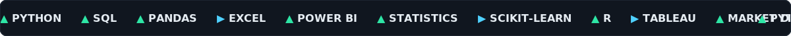
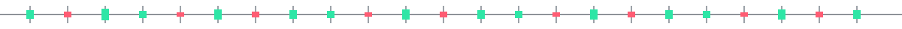
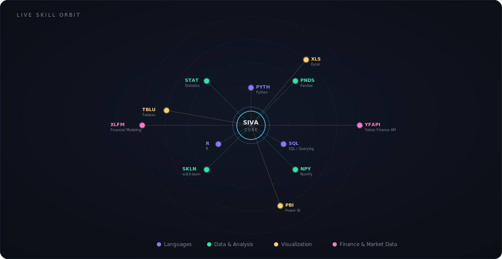

 

  

  

> Everything below is what I'm learning or have touched so far — trim this down to what's actually true for you as you go.

### `$ ls featured-projects/`

> Placeholders below — swap in the real repo link, description, and a cover image once each project is done.

<table>
<tr>
<td width="33%" valign="top">

**📈 01 — Stock Price Predictor**
*status: not started*

A model that predicts short-term stock price movement from historical data. Will cover data collection, feature engineering, and a basic ML model.

`Python` `pandas` `scikit-learn`

[repo link →](#)

</td>
<td width="33%" valign="top">

**📊 02 — Market Dashboard**
*status: not started*

An interactive dashboard tracking a small portfolio or index — prices, returns, and simple risk metrics, built for quick daily reading.

`Power BI` / `Tableau` `SQL`

[repo link →](#)

</td>
<td width="33%" valign="top">

**🤖 03 — Trading Strategy Backtester**
*status: not started*

A simple backtesting tool to test a basic trading rule (e.g. moving average crossover) against historical price data.

`Python` `pandas` `matplotlib`

[repo link →](#)

</td>
</tr>
</table>

### `$ github-stats --live`

 

 

*"The market rewards patience more than genius — I'm hoping the same is true for learning to code."*

